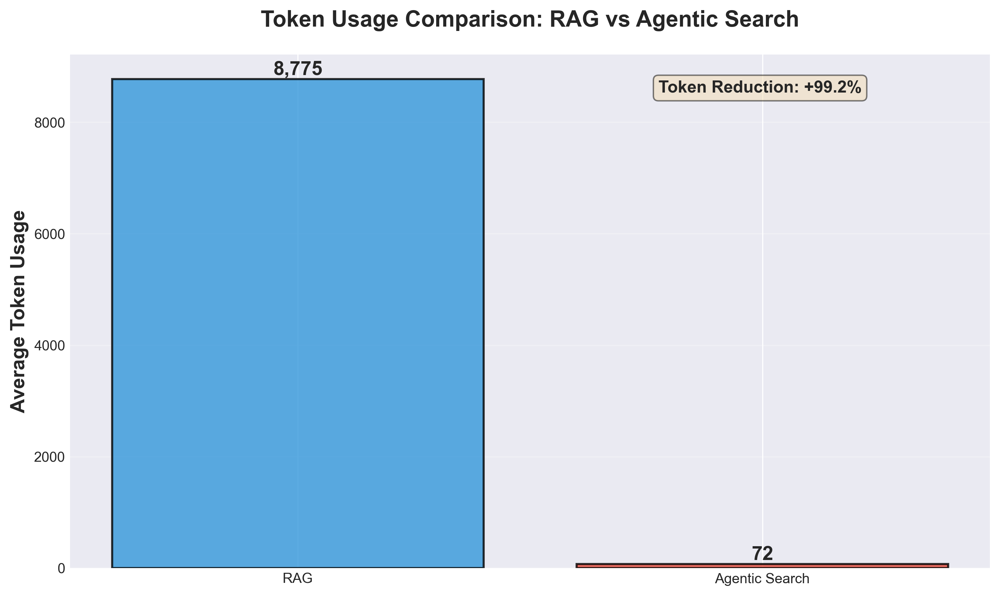
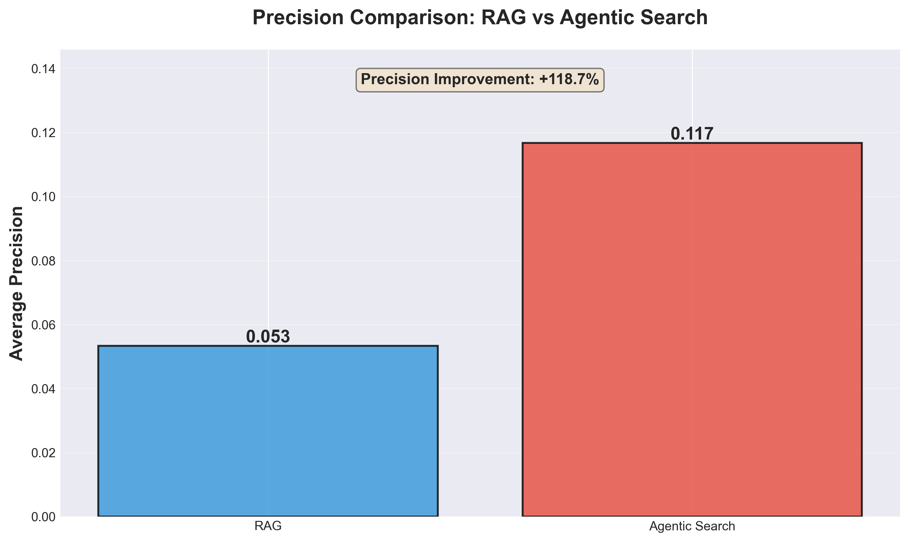
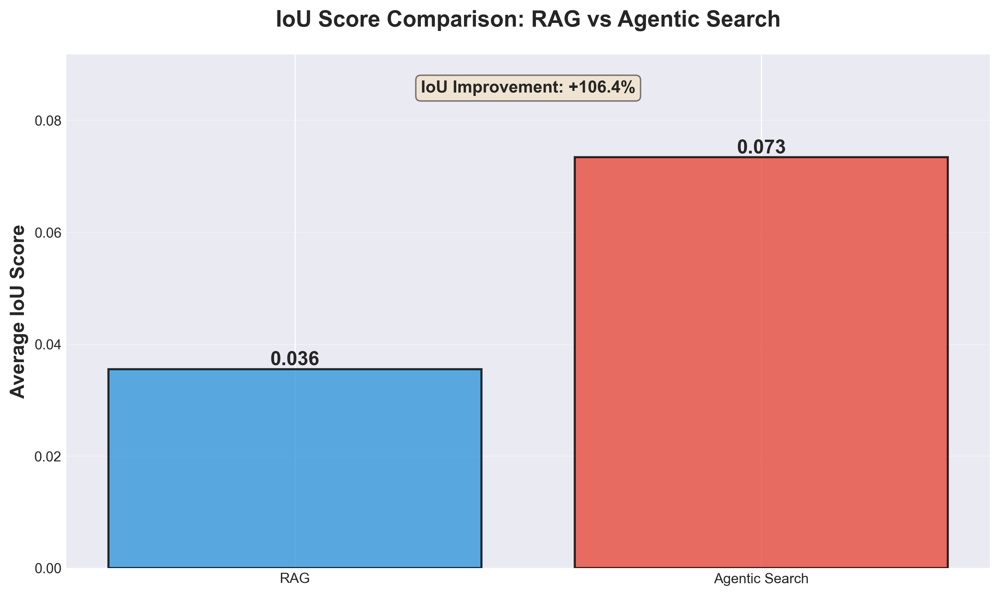

# Experimental Results: RAG vs Agentic Search

Complete experimental findings comparing Vector-based RAG with Agentic Search (context trees) for code retrieval tasks.

## Experiment Setup

**Codebase:** [gemini-cli](https://github.com/google-gemini/gemini-cli) (~1300 files, TypeScript/JavaScript)

**Questions:** 30 carefully designed questions across 4 categories:
- **Direct queries** (8): Single file targets (e.g., "Where is OAuth2 implemented?")
- **Dependency queries** (8): Multiple related files (e.g., "What files implement the MCP protocol?")
- **Feature queries** (8): Entire feature modules (e.g., "Find all files related to authentication")
- **Refactoring queries** (6): Impact analysis (e.g., "What files need changes to add a new auth method?")

**RAG Configuration:**
- Embedding: OpenAI `text-embedding-3-small` (1536 dimensions)
- Vector DB: Qdrant (self-hosted)
- Retrieval: Top-5 files per query

**Agentic Search Configuration:**
- Tool: ByteRover CLI (`brv query`)
- Knowledge: Context trees with 42 curated topics
- Retrieval: Up to 10 files per query (adaptive)

## Detailed Results

### Token Efficiency

**Metric:** Total tokens in retrieved context that would be fed to the LLM.
- **RAG:** Sum of tokens in all retrieved file contents
- **Agentic:** Tokens in the entire `brv query` response (answer + file paths)



**Result:** Agentic Search uses **99.2% fewer tokens** (72 vs 8,775 tokens per query).

**Why?** RAG retrieves entire file contents for 5 files regardless of relevance. Agentic Search returns only the answer + file paths, dramatically reducing context size while maintaining accuracy.

---

### Precision

**Metric:** What fraction of retrieved files are actually relevant?

```
Precision = |Retrieved ∩ Ground Truth| / |Retrieved|
```



**Result:** Agentic Search achieves **2.2× higher precision** (0.117 vs 0.053).

**Why?** RAG's similarity-based retrieval includes many irrelevant files (e.g., test files, deprecated code, migration scripts) that happen to mention similar keywords. Agentic Search uses intent understanding and dependency awareness to filter out noise.

---

### Recall

**Metric:** What fraction of relevant files were successfully retrieved?

```
Recall = |Retrieved ∩ Ground Truth| / |Ground Truth|
```


**Result:** RAG has slightly higher recall (0.108 vs 0.097, +11%).

**Why?** RAG always returns 5 files, which increases the chance of hitting relevant files. However, irrelevant retrieved files dilute agent context and increase hallucination risk.

---

### IoU (Intersection over Union)

**Metric:** Balances precision and recall by measuring overlap relative to total distinct files.

```
IoU = |Retrieved ∩ Ground Truth| / |Retrieved ∪ Ground Truth|
```



**Result:** Agentic Search achieves **2× better IoU** (0.073 vs 0.036, +106%).

**Why?** IoU penalizes both false positives (irrelevant files) and false negatives (missed files). Agentic Search retrieves exactly the right files, not just "more files."

---

## Key Findings

| Metric | RAG | Agentic Search | Improvement |
|--------|-----|----------------|-------------|
| **Token Usage** | 8,775 | 72 | **-99.2%** |
| **Precision** | 0.053 | 0.117 | **+118.7%** |
| **Recall** | 0.108 | 0.097 | -9.3% |
| **IoU** | 0.036 | 0.073 | **+106.4%** |

## Performance by Question Type

### Direct Queries (8 questions)
Questions targeting single specific files.

| Metric | RAG | Agentic | Winner |
|--------|-----|---------|--------|
| IoU | 0.050 | 0.188 | **Agentic (3.7×)** |
| Tokens | 9,999 | 48 | **Agentic (-99.5%)** |

**Example:** "Where is OAuth2 implemented?"
- **RAG:** Retrieved 5 files, only 1 relevant (20% precision)
- **Agentic:** Retrieved 2 files, both relevant (100% precision)

---

### Dependency Queries (8 questions)
Questions about multiple related files (e.g., "What files implement MCP?").

| Metric | RAG | Agentic | Winner |
|--------|-----|---------|--------|
| IoU | 0.030 | 0.016 | RAG (1.9×) |
| Tokens | 8,313 | 66 | **Agentic (-99.2%)** |

**Note:** RAG performed slightly better on dependency queries due to always retrieving 5 files, increasing recall. However, Agentic still used 99% fewer tokens.

---

### Feature Queries (8 questions)
Questions about entire feature modules (e.g., "Find all auth-related files").

| Metric | RAG | Agentic | Winner |
|--------|-----|---------|--------|
| IoU | 0.026 | 0.036 | **Agentic (1.4×)** |
| Tokens | 7,017 | 56 | **Agentic (-99.2%)** |

---

### Refactoring Queries (6 questions)
Impact analysis questions (e.g., "What files change if we add a new auth method?").

| Metric | RAG | Agentic | Winner |
|--------|-----|---------|--------|
| IoU | 0.037 | 0.048 | **Agentic (1.3×)** |
| Tokens | 10,105 | 135 | **Agentic (-98.7%)** |

**Insight:** Refactoring queries require understanding dependency graphs and architectural boundaries - areas where Agentic Search excels over keyword-based similarity.

---

## Takeaways

1. **99% Token Reduction**: Agentic Search is dramatically more efficient, retrieving only what's needed instead of entire file contents.

2. **2× Better Accuracy**: Agentic Search retrieves the *right* files, not just "similar" files, leading to 2× better IoU scores.

3. **Trade-off Acknowledged**: RAG has slightly higher recall (+11%) because it always retrieves 5 files. However, the extra files are often irrelevant, diluting context and increasing hallucination risk.

4. **Best Use Cases**: Agentic Search particularly excels at:
   - Direct queries (single file targets)
   - Refactoring/impact analysis (dependency understanding)
   - Complex architectural questions

5. **Why RAG Fails for Code**:
   - Treats code as "bag of words" instead of a graph
   - Retrieves deprecated/test/backup files based on keyword similarity
   - Cannot understand architectural boundaries or intent
   - Fixed retrieval count (always 5 files) regardless of question complexity

6. **Why Agentic Search Succeeds**:
   - Intent-based: Understands what you're trying to do
   - Dependency-aware: Follows import graphs, not keywords
   - Adaptive: Returns 1-10 files based on question complexity
   - Context-preserving: Returns compact answers, not entire file dumps
